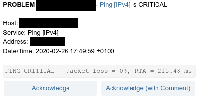
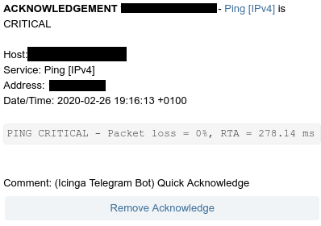
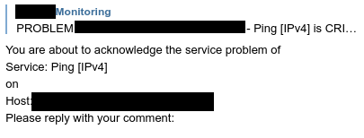
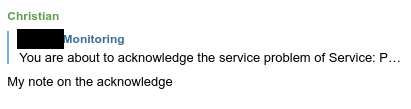
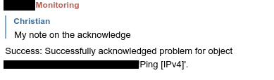
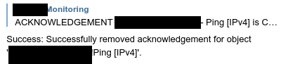

# icinga-telegram-bot
Send notifications and acknoledgments via Telegram to Icinga2 via API.

## Installation

### Setting up icinga-telegram-bot
* on Ubuntu install python3 and venv
```
sudo apt install python3-venv python3
```

* create a virtual environment (e.g. in /opt)
```
cd /opt
git clone https://github.com/joni1993/icinga-telegram-bot.git
cd icinga-telegram-bot
python3 -m venv venv
source venv/bin/activate
pip install -r requirements.txt
```

* copy example configuration ```cp icinga-telegram-bot.config.example icinga-telegram-bot.config```

* edit the configuration according to your needs

* test icinga-telegram-bot works by issuing ```venv/bin/python3 -m icingatelegrambot.app --config_file=icinga-telegram-bot.config```

### Install Systemd service
* ```sudo cp contrib/icinga-telegram-bot.service /etc/systemd/system```
* ```sudo systemctl daemon-reload```
* ```sudo systemctl start icinga-telegram-bot```
* ```sudo systemctl enable icinga-telegram-bot``` 

### Icinga2 API
* Create an API user in icinga with at least the following permissions
```
vim /etc/icinga2/conf.d/api-users.conf

object ApiUser "icinga-bot" {
  password = "icinga"

  permissions = [ "objects/query/Host", "objects/query/Service", "status/query", "actions/*" ]
}
```

For further details check the [Icinga2 API documentation](https://icinga.com/docs/icinga2/latest/doc/12-icinga2-api)

### Telegram Bot API
Check the [official instructions](https://core.telegram.org/bots) for creating a Telegram bot

### Install the Notifications scripts
* Copy the scripts from contrib folder to your Icinga2 installation
```
sudo cp contrib/*.sh /etc/icinga2/scripts/
```

* Set your notifications to use these scripts (check out [this blogpost](https://www.netways.de/blog/2016/10/07/telegram-notifications-von-icinga-2/) or [this repository](https://github.com/lazyfrosch/icinga2-telegram - but use the scripts from the icinga-telegram-bot repository))

## Run the bot
```
venv/bin/python3 -m icingatelegrambot.app --config_file=icinga-telegram-bot.config -h
usage: app.py [-h] [--config_file CONFIG_FILE]

This is an Icinga2 Telegram bot. It can be used to interact with Icinga2 from
your Telegram client. It uses the Icinga2 API. Version: 0.1.0 (2020-02-26)

optional arguments:
  -h, --help            show this help message and exit
  --config_file CONFIG_FILE
                        points to the config file to read config data from
                        which is not installed under the default path
                        './icinga-telegram-bot.config'")
```

## Configuration
The bot features some options in its configuration:

* ```allowed_chat_ids = [1234567890] # Specifies which Telegram chat ids are allowed to issue commands``` 
* ```commands_only_administrators = true # Specifies if only Telegram Group Administrators can issue commands```

## Use the bot
These functions are currently implemented:
* ```/send_notification (Host|Service);(Hostname);(Servicename);Your text```
    * (Host|Service) specifies if you want to send a notification to a host or a service (e.g. Host)
    * (Hostname) specifies the hostname (e.g. my-hostname)
    * (Servicename) specifies the servicename (e.g. my-servicename) - only specify when first argument is Service
    
 * Notifications
  
 
 
 * Quick Acknowledge 
 
 
 
 * Acknowledge with own Text
 
 
 
 
 
 
 
 * Remove Acknowledgement
 
 
 
 ## Todo
 * Implement User ACL (registration, permissions, ...)
 * Commands for querying Hosts / Services
 * Commands for scheduling downtimes
 * Icinga Status Check (check Icinga 2application status regularly and notify about errors)